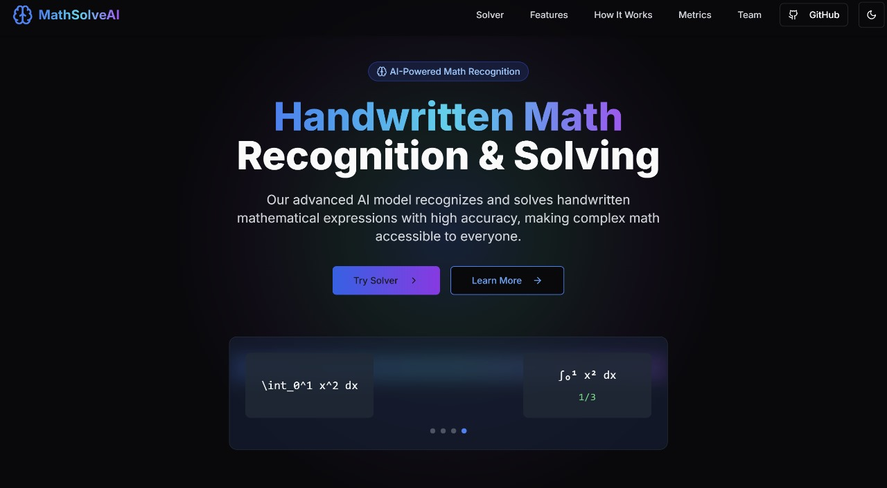
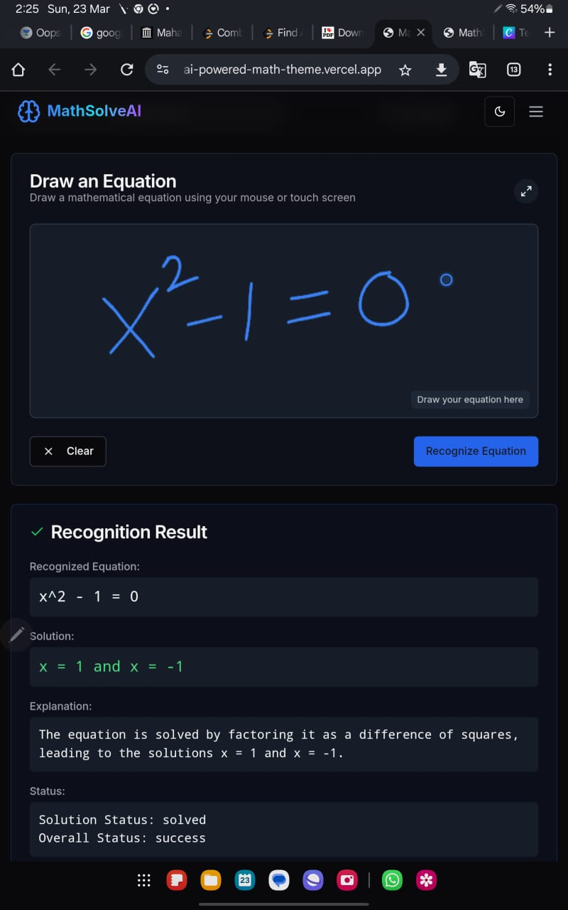
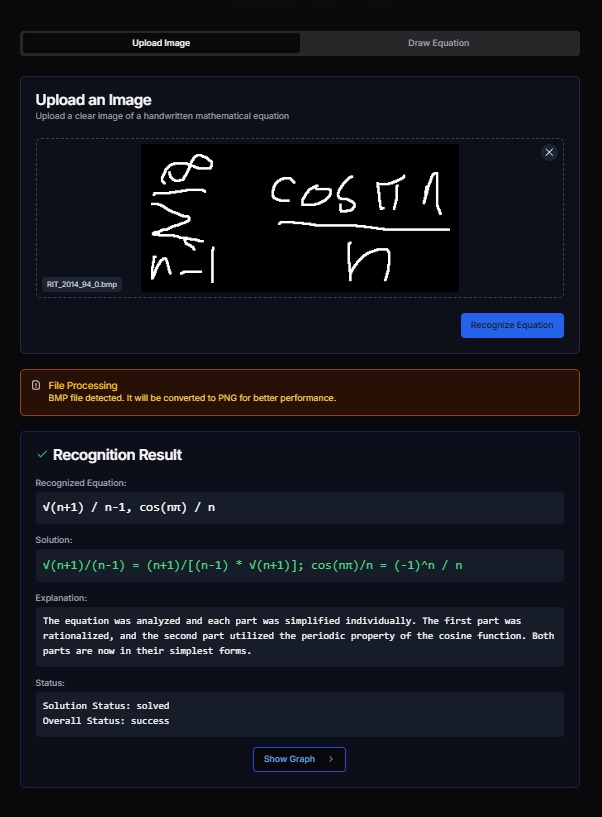

# AI Model for Handwritten Math Expression Recognition & Solving

## 🌐 Live Website
Check out the live version of our project here: **[AI-Powered Math Solver](https://v0-ai-powered-math-theme.vercel.app/)**





## 🚀 Project Overview
This project aims to develop an AI-powered system that can **recognize and solve handwritten math expressions** from images. The model accurately detects numbers and mathematical symbols, solves the equations, and provides a step-by-step explanation. The system is deployed as a **responsive web application** with a draw feature for user-friendly interaction.

## 🎯 Features
- **Handwritten Math Recognition** using **Qwen**
- **Equation Solving** powered by **DeepSeekDistill & LLaMA 70B**
- **Real-time Solution with Step-by-Step Explanation**
- **Interactive Website** developed with **React & Flask**
- **Draw Feature** for direct input and solution generation
- **Cloud-based Deployment** using **Cloudflare & Postman API**

## 📊 Model Development
| Model | Accuracy |
|--------|----------|
| CNN | 91% |
| EfficientNet | 93% |
| ResNet | 93% |
| DenseNet | 97% |
| Qwen | Improved Recognition |
| DeepSeekDistill + LLaMA 70B | Improved Solving |

## 🏗️ Tech Stack
### **Frontend**
- **React.js** (Responsive UI)
- **Tailwind CSS** (Styling)

### **Backend**
- **Flask** (RESTful API Development)
- **Postman API** (Testing & Deployment)
- **Cloudflare** (Public API Hosting)

### **AI & ML**
- **Qwen** (Handwriting Recognition)
- **DeepSeekDistill & LLaMA 70B** (Equation Solving)
- **TensorFlow/PyTorch** (Model Training)

## 🔧 Installation & Setup
1. **Clone the Repository:**
   ```bash
   git clone https://github.com/yourusername/handwritten-math-ai.git
   cd handwritten-math-ai
   ```
2. **Install Backend Dependencies:**
   ```bash
   pip install -r backend/requirements.txt
   ```
3. **Run the Flask API:**
   ```bash
   cd backend
   python app.py
   ```
4. **Install Frontend Dependencies & Start React App:**
   ```bash
   cd frontend
   npm install
   npm run dev
   ```

## 🚀 Usage
- Upload a handwritten math expression **or use the draw feature**.
- The model will **recognize and solve** the equation.
- Get a **step-by-step explanation** of the solution.


## 🛠️ Future Enhancements
- Support for **fractions, square roots, and algebraic equations**
- **Mobile app** for wider accessibility
- **Multilingual support** for broader usability

## 📜 License
This project is licensed under the **MIT License**.

## 🤝 Contributing
We welcome contributions! Feel free to **fork** the repo, create a feature branch, and submit a PR.

## Contact
22


---
🚀 **Transforming handwritten math recognition with AI!**
